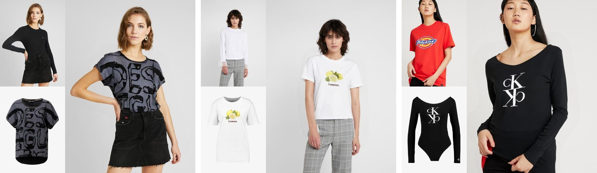

# [ICPR2026] SIFT-VTON: Geometric Correspondence Supervision on Cross-Attention for Virtual Try-On

[](https://arxiv.org/abs/2605.01296)
[](https://huggingface.co/takesuke/SIFT-VTON)

&nbsp;

This repository is derived from [StableVITON](https://github.com/rlawjdghek/stableviton).

## Updates
- **2026-08-13** — [arXiv v2](https://arxiv.org/abs/2605.01296) is online. It reports the released checkpoint's numbers (see [Results](#results)); §3.1 is unchanged, since the released weights implement the method exactly as it was already described there.
- **2026-08-05** — Released weights updated (`sift_matching.zip` was updated on 2026-07-30). The checkpoint and correspondences on [🤗 takesuke/SIFT-VTON](https://huggingface.co/takesuke/SIFT-VTON) are now produced with the corrected SIFT filtering — the method exactly as described in arXiv v1 §3.1 — and improve on the arXiv v1 numbers across all four metrics, see [Results](#results). These are the numbers reported in arXiv v2. To reproduce the arXiv v1 model instead, see [Reproducing the arXiv v1 result](#reproducing-the-arxiv-v1-result).
- **2026-07-20** — The SIFT scale filter (`filter_scale`) was inactive in the paper's experiments; fixed in `4438ff6`, and `--legacy_filtering` added to regenerate the paper's correspondences exactly. The fix changes ~2.5% of matches across ~8% of image pairs, leaving 92% of files unchanged. Details: [#2](https://github.com/takesukeDS/SIFT-VTON/issues/2).

## TODO
- [x] Code for preprocessing
- [x] Filtered SIFT correspondences(json) on VITON-HD dataset
- [x] Code for training SIFT-VTON
- [x] Code for inference 
- [x] Trained weights of SIFT-VTON
- [x] Instructions for preprocessing
- [x] Instructions for training 
- [x] Instructions for inference 

## Environments
The environment is fully locked: `pyproject.toml` + `uv.lock` pin Python 3.12.8 and every package version, including CUDA 12.8 builds of PyTorch. Two ways to set it up:

### Option 1: [uv](https://docs.astral.sh/uv/) (recommended)
```bash
# install uv if you don't have it
curl -LsSf https://astral.sh/uv/install.sh | sh

git clone https://github.com/takesukeDS/SIFT-VTON
cd SIFT-VTON
uv sync   # installs Python 3.12.8 + all locked dependencies into .venv
```
Run any script with `uv run`, e.g. `uv run python inference_hf.py ...`, or activate `.venv` directly.

### Option 2: pip
`requirements.txt` is exported from `uv.lock` (it includes the PyTorch cu128 index):
```bash
git clone https://github.com/takesukeDS/SIFT-VTON
cd SIFT-VTON
python3.12 -m venv .venv && source .venv/bin/activate
pip install -r requirements.txt
```

> **Note:** SIFT is provided by the pinned `opencv-python-headless` package (`cv2.SIFT_create` is in mainline OpenCV ≥ 4.4). `opencv-contrib-python` is **not** required, and the headless build avoids any system `libGL` dependency on servers.

## Weights and Data Preparation
Our weights are publicly available on huggingface [takesuke/SIFT-VTON](https://huggingface.co/takesuke/SIFT-VTON), 
and inference_hf.py automatically downloads the weights from huggingface when you run inference.


### For inference (minimum data preparation)
You can download the VITON-HD dataset from [here](https://github.com/shadow2496/VITON-HD).<br>

Pairs definition files for the train/val/test splits (`siftvton_train_pairs.txt`, `siftvton_val_pairs.txt`, `siftvton_test_pairs.txt`) are available on the [huggingface model repo](https://huggingface.co/takesuke/SIFT-VTON). Download them and place them directly under the dataset root directory:
```bash
hf download takesuke/SIFT-VTON siftvton_train_pairs.txt siftvton_val_pairs.txt siftvton_test_pairs.txt --local-dir [VITON-HD dataset dir]
```

For inference, the following VITON-HD dataset structure is required:
```
[VITON-HD dataset dir]
|-- train
|   |-- image
|   |-- image-densepose
|   |-- agnostic-v3.2
|   |-- agnostic-mask
|   |-- cloth
|   |-- cloth-mask
|   |-- gt_cloth_warped_mask (for ATV loss)
|-- test
|   |-- image
|   |-- image-densepose
|   |-- agnostic-v3.2
|   |-- agnostic-mask
|   |-- cloth
|   |-- cloth-mask
|-- siftvton_train_pairs.txt
|-- siftvton_val_pairs.txt
|-- siftvton_test_pairs.txt
```

### For SIFT matching and filtering (Optional)
If you want to compute SIFT correspondences manually for training,
download Fine-grained Parsing in [GP-VTON](https://github.com/xiezhy6/GP-VTON) for VITON-HD dataset.
We used garment parts segmentation provided by GP-VTON for better spatial matching.
We refer the directory where you unzipped the cloth parsing as `[cloth_parsing_dir]` in the following instructions.

## Inference
```bash
uv run python inference_hf.py \
    --repo_id takesuke/SIFT-VTON \
    --data_root_dir [VITON-HD dataset dir] \
    --save_dir [output dir] \
    --phase test \
    --batch_size 4 \
    --start_from_noised_agn \
    --repaint
```
The checkpoint and config are downloaded from the [huggingface model repo](https://huggingface.co/takesuke/SIFT-VTON) on the first run and cached under `~/.cache/huggingface/hub/`. Images are written to `[output dir]/pair`, or `[output dir]/unpair` with `--unpair`; both are the inputs expected by [Evaluation](#evaluation).

| Argument | Default | Description |
|---|---|---|
| `--cfg_scale` | `1.5` | Classifier-free guidance scale; the value used for the reported results |
| `--denoise_steps` | `50` | Number of denoising steps |
| `--start_from_noised_agn` | off | Start denoising from the noised agnostic image instead of pure noise (recommended) |
| `--repaint` | off | Paste back the unmasked region from the original image after generation (recommended) |
| `--unpair` | off | Run unpaired inference (person and garment from different samples) |
| `--phase` | `test` | `test` for the test split, `train` for the training split |
| `--seed` | `1235` | Random seed |

To run from local files instead of the Hub, pass `--config_path` and `--model_load_path` in place of `--repo_id`.

## Preprocessing: SIFT matching and filtering for training on VITON-HD dataset
The code below saves the filtered SIFT correspondences in json for each image pair in the VITON-HD dataset. 
```
python save_sift_matching.py --save_dir [output dir] --data_root_dir [VITON-HD dataset dir] --data_type train --cloth_segmentation_base_dir [cloth_parsing_dir] 
```
Move `[output dir]/train` into `[VITON-HD dataset dir]/train` as `sift_matching` like below if you want to run training code:
```
mv [output dir]/train [VITON-HD dataset dir]/train/sift_matching
```

Alternatively, you can download the precomputed SIFT correspondences for the train split from the [huggingface model repo](https://huggingface.co/takesuke/SIFT-VTON) and place it under the `train` directory of the VITON-HD dataset. This archive is the training data of the released weights, i.e. corrected filtering:
```bash
hf download takesuke/SIFT-VTON sift_matching.zip --local-dir [VITON-HD dataset dir]/train
cd [VITON-HD dataset dir]/train
unzip sift_matching.zip
```

### Reproducing the arXiv v1 result
Earlier revisions of the huggingface model repo remain accessible, so the arXiv v1 checkpoint and correspondences can still be downloaded by pinning a commit.

**arXiv v1 weights** (commit `c369585b3dd3`, 2026-06-07). Download the checkpoint alone and pair it with the current config — the `config.yaml` stored at that revision predates the `YahaVTON` → `SiftVTON` rename and will not load against this code:
```bash
hf download takesuke/SIFT-VTON model.ckpt --revision c369585b3dd3 --local-dir ./ckpts/arxiv_v1

uv run python inference_hf.py \
    --config_path configs/SIFT-VTON_sift_loss_ave.yaml \
    --model_load_path ./ckpts/arxiv_v1/model.ckpt \
    --data_root_dir [VITON-HD dataset dir] \
    --save_dir [output dir] \
    --phase test \
    --batch_size 4 \
    --start_from_noised_agn \
    --repaint
```

**arXiv v1 correspondences** (commit `bd1bbcd5e5d9`, 2026-06-13):
```bash
hf download takesuke/SIFT-VTON sift_matching.zip --revision bd1bbcd5e5d9 --local-dir [VITON-HD dataset dir]/train
cd [VITON-HD dataset dir]/train && unzip sift_matching.zip
```
Equivalently, `--legacy_filtering` regenerates them from the VITON-HD dataset:
```bash
python save_sift_matching.py --save_dir [output dir] --data_root_dir [VITON-HD dataset dir] --data_type train --cloth_segmentation_base_dir [cloth_parsing_dir] --legacy_filtering
mv [output dir]/train [VITON-HD dataset dir]/train/sift_matching
```
Training on these with the command in [Training](#training) reproduces the arXiv v1 model rather than the released weights.

## Training

Download StableVITON's pretrained checkpoint for VITON-HD from [StableVITON](https://github.com/rlawjdghek/stableviton) and place it under `ckpts/`. 

SIFT matching data (`sift_matching/` under `[VITON-HD dataset dir]/train/`) is required — see [For SIFT matching and filtering](#for-sift-matching-and-filtering-optional) above.

```bash
CUDA_VISIBLE_DEVICES=0,1 python train_siftvton.py \
    --config_name SIFT-VTON_sift_loss_ave \
    --data_root_dir [VITON-HD dataset dir] \
    --pretrained_path ckpts/[StableVITON checkpoint filename] \
    --save_root_dir [output dir] \
    --save_name train_siftvton \
    --transform_size hflip shiftscale \
    --transform_color hsv bright_contrast \
    --use_sift_loss \
    --sift_loss_scale 0.0005 \
    --snr_gamma 5.0 \
    --accum_iter 8 \
    --batch_size 4 \
    --save_every_n_epochs 20 \
    --valid_epoch_freq 10
```

| Flag | Value | Description |
|---|---|---|
| `--use_sift_loss` | toggle | Enable SIFT correspondence supervision on cross-attention |
| `--sift_loss_scale` | `0.0005` | Weight of SIFT loss relative to diffusion loss |
| `--snr_gamma` | `5.0` | Min-SNR loss weighting |
| `--accum_iter` | `8` | Gradient accumulation steps. `--batch_size` is the global batch (split across GPUs), so effective batch = `batch_size × accum_iter` = 32 |

## Results
VITON-HD test set at 384×512. SSIM/LPIPS are computed on the paired setting, FID/KID on the unpaired setting.

| Model | SSIM ↑ | LPIPS ↓ | FID ↓ | KID×1000 ↓ |
|---|---|---|---|---|
| SIFT-VTON (arXiv v1) | 0.8877 | 0.0751 | 8.860 | 1.092 |
| SIFT-VTON (released weights, arXiv v2) | **0.8889** | **0.0738** | **8.593** | **0.754** |

The released checkpoint implements the method exactly as described in arXiv v1 §3.1, including the scale-consistency filter. The arXiv v1 numbers were produced before the `filter_scale` bug was fixed ([#2](https://github.com/takesukeDS/SIFT-VTON/issues/2)), i.e. from correspondences filtered by the angle, HSV, and RANSAC constraints only; arXiv v2 reports the released checkpoint's numbers instead. To reproduce the arXiv v1 model, see [Reproducing the arXiv v1 result](#reproducing-the-arxiv-v1-result).

> KID is computed by clean-fid over unseeded random subsets and varies by roughly 1% between runs. SSIM, LPIPS, and FID are exactly reproducible for a fixed set of predictions.

## Evaluation
`evaluate.py` computes the metrics in the [Results](#results) table above, using the same protocol as the paper. Predictions are the images produced by the inference scripts (the `pair` / `unpair` output directories).

SSIM and LPIPS (paired test set):
```bash
uv run python evaluate.py \
    --data_root_dir [VITON-HD dataset dir] \
    --pred_dir [inference output dir]/pair \
    --mode paired
```

FID and KID (unpaired test set):
```bash
uv run python evaluate.py \
    --data_root_dir [VITON-HD dataset dir] \
    --pred_dir [inference output dir]/unpair \
    --mode unpaired
```

Implementation details (matching the paper's evaluation): SSIM/LPIPS are computed on full images resized to 384×512 (torchmetrics: AlexNet LPIPS, SSIM with `data_range=1.0`); FID/KID are computed with [clean-fid](https://github.com/GaParmar/clean-fid) against `test/image`. KID is multiplied by 1000, as in the paper.

> **Note on reproducibility:** inference uses a fixed random seed (`--seed 1235` by default), and evaluating a fixed set of generated predictions with `evaluate.py` is exactly reproducible.

## Citation
```bibtex
@misc{takemoto2026siftvton,
  title         = {{SIFT-VTON}: Geometric Correspondence Supervision on Cross-Attention for Virtual Try-On},
  author        = {Takemoto, Kosuke and Koshinaka, Takafumi},
  year          = {2026},
  eprint        = {2605.01296},
  archivePrefix = {arXiv},
  primaryClass  = {cs.CV},
  url           = {https://arxiv.org/abs/2605.01296}
}
```

## License
Licensed under the CC BY-NC-SA 4.0 license (https://creativecommons.org/licenses/by-nc-sa/4.0/legalcode).
